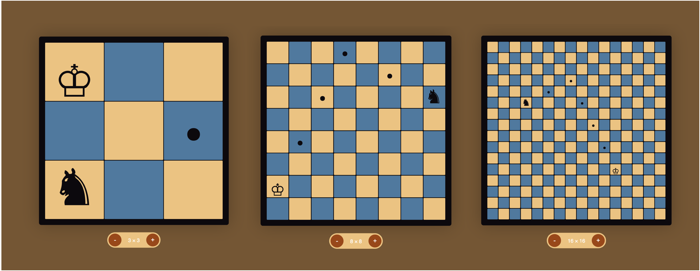

# Knight Travails

**Calculates the shortest path on a chess board**

This is a little program that calculates the path a knight can take from any square to another. It works on a board of any dimensions and has a worst-case runtime of O(n), where n = total number of squares.

I completed this project as coursework for The Odin Project's Computer Science module ([assignment page](https://www.theodinproject.com/lessons/javascript-knights-travails)).

* **Live demo:** https://stephengroe.github.io/top-knight-travails/
* **Built with:** Vanilla JS, HTML5, CSS3
* **License:** MIT

## Features

### Find shortest path

The program uses a breadth-first search of dynamically created nodes to calculate the shortest path from one square to another using legal moves for a knight in a standard game of chess.

### (Theoretically) infinite board size

All functions will work on a board of theoretically any rectangular dimensions. The page limits the size to between 3×3 - 16×16 for better functionality. (There are no legal moves on a 2×2 board, and squares on boards bigger than 16×16 get hard to see and click on).

### Animation and display

All inputs are done by the user by clicking on the board, and a simple animation is displayed once a start and end destination have been selected. The board resets after displaying the animation.

## Improvements

Because this is a small exercise, I might not be stopping back to make these changes. But if I do, this is what's on my list!

I'd like to add these additional features:

* **Better piece alignment.** Currently the pieces are Unicode characters. This leaves some alignment issues depending on font. I'd like to switch to SVGs sometime in the future.

* **Validate if legal moves exist.** On a small board (e.g., 3×3), some moves aren't possible. I'd like to validate these beforehand and prevent the user from selecting them.

* **Rectangular board size.** It'd be nice to select a board of any dimensions, like 3×7 or 14×8. Right now the display only supports square boards (but the functions support any dimensions).

These are known bugs:

* **Can't place knight on starting position.** Due to overlapping DOM elements, you can't click to place the knight on its randomly selected start position.

* **Jumps to destination when no legal moves exist.** If there is no path from one square to another using legal Knight moves (e.g., from [0,0] to [2,1] on a 3×3 board), it will move there immediately.